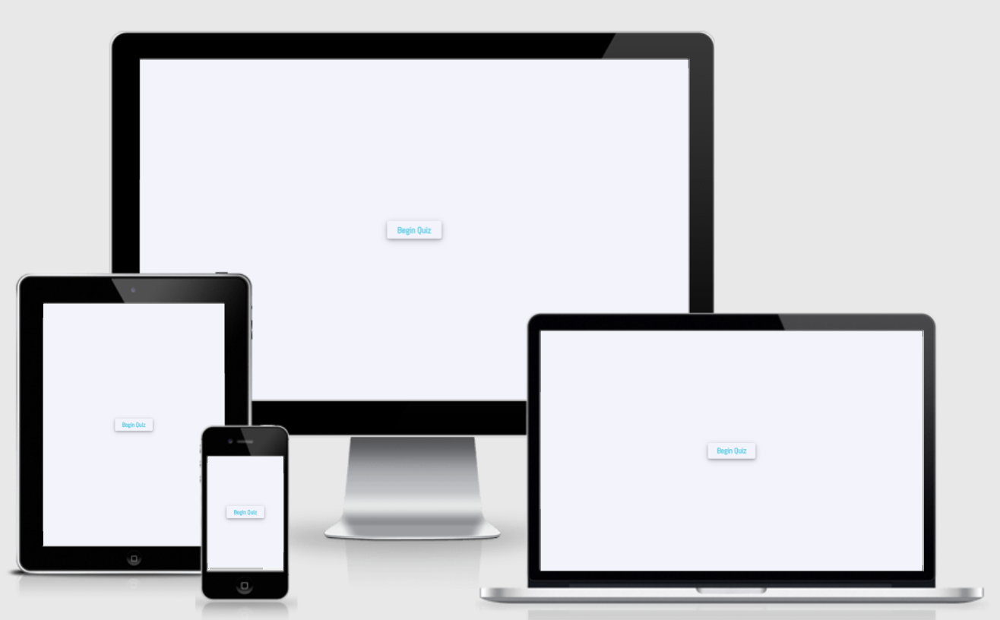

# The Game Master

The Game Master is a quiz designed to test the user knowledge on video games. Video games have been around from a long time now and have been evolving constantly. Unlike the first video games that came out in the early 1970s, nowadays the technology used to develop them has evolved, allowing developers to create visual and techonological masterpieces.

The idea behind The Game Master is very simple. When the users access the website, they will be promted with a start button. Once that is clicked they will have the opportunity to read a set of rules about the game. They can either continue and start playing or quit. Once the game has been started they will have a set of 15 questions to answer before the quiz finishes. The end screen will vary depending on the user score. Lastly, they can either try again or quit the quiz.

The primary goal of this website is to give users the opportunity to test their knowledge on video gaming history.

The Game Master was created for my Milestone 2 projefct in the Full Stack Web Development course I am currently undertaking at Code Institute.

[Live website link](https://mflaviusm.github.io/project-2-template/)
## Features 

The Game Master was designed with the user in mind to offer the best possible UX and UI.

# Table of Contents

1. [ Project Goals](https://github.com/mflaviusm/GENUS#project-goals)
2. [UX](https://github.com/mflaviusm/GENUS#ux)
3. [ Strategy Plane](https://github.com/mflaviusm/GENUS#strategy-plane)
    * [User Stories](https://github.com/mflaviusm/GENUS#user-stories)
4. [ Scope Plane](https://github.com/mflaviusm/GENUS/#scope-plane)
    * [ Existing Features](https://github.com/mflaviusm/GENUS#existing-features)
    * [ Features not implement](https://github.com/mflaviusm/GENUS#features-not-implemented)
5.  [ Structure Plane](https://github.com/mflaviusm/GENUS#structure-plane)
6.  [ Skeleton Plane](https://github.com/mflaviusm/GENUS#skeleton-plane)
7.  [ Surface Plane](https://github.com/mflaviusm/GENUS#surface-plane)
8. [ Technologies](https://github.com/mflaviusm/GENUS#technologies)
9. [ Testing](https://github.com/mflaviusm/GENUS#testing)
10. [Deployment](https://github.com/mflaviusm/GENUS#deployment)
11. [Credits](https://github.com/mflaviusm/GENUS#credits)
12. [Acknowledgements](https://github.com/mflaviusm/GENUS#acknowledgements)

## Project Goals
  * Create a challenging quiz for video game enthusiasts
  * To promote gaming and video games
  * To offer an intuitive UI and excellent UX
  * To present users fun take on video games history
  * To provide content on video games

## UX
UX design and principle were central and of the utmost importance for the development of this website. The five planes were used when sketching the quiz structure and content and throughout the development of it.

# Strategy Plane
### Client Goals
* As a client, I want an intuitive platform.
* As a client, I want a product that is engaging and has various functionality.
* As a client, I want to offer my visitors an excellent user experience that will make them want to return.
* As a client, I will look for accurate information that is displayed accordingly to persuade users to use my platform.

## User Stories
* As a visitor, I want to understand what the platform has to offer.
* As a visitor, I want an intuitive platform that I can easily navigate.
* As a visitor, I want to put my knowledge of video games to test.

## Opportunity Goal Table

At the planning stages of the development, the opportunities for the website were determined and ranked according to their viability and importance.

| Opportunity | Importance | Viability |
| ----------- | ---------- | --------- |
| 1. Develop an online presence | 5 | 5 |
| 2. Create an intuitive product | 5 | 4 |
| 3. Promote the game | 4 | 3 |
| 5. Increase user feedback | 4 | 4 |
| 6. Provide contact information | 3 | 4 |
| 8. Offer additional funcionality | 4 | 1 |

# Scope Plane

During the strategy stage of the development, features were verified against the viability and importance criteria. This ensured the project will not go beyond its short-term goals, therefore each feature has been categorised for immediate or future releases. The table below highlights each feature and its release date.

| Feature | Release | 
| ----------- | ---------- | 
| Develop an online presence | 1 |
| 2. Create an intuitive product | 1 |
| 3. Promote the game | 2 |
| 5. Increase user feedback | 3 |
| 6. Provide contact information | 2 |
| 8. Offer additional funcionality | 3 |

*1 - Immediate Release 2 - Short-term release 3 - Long-term*

## Existing Features

* Mobile responsive design
  * Although The Game Master has not been developed as a mobile-first design, it has been revised to offer responsiveness on any type of device it is accesed from (using Cascading Style Sheets) to allow users an enjoyable experience whilst playing the quiz.
* Start Game Button
  * The start game button is the only feature users will see when accessing the website.
  * The start game button will send users to the rules page of the quiz to get a better understanding of the product.
* The Game Rules Page
  * The game rules page will allow users to get information the information on how to play and what to expect.
* The Quiz Play Page
  * The quiz comes with various funcionality. It has a score tracker that shows the player their score in real time. The correct answers are accompagned by a tick icon, whilst the wrong answers have a cross icon.
  * The quiz comes with a timer of 15 seconds for each question. When the timer is up and the user has not made a choice, they will no longer be able to.
  * After each answer if the user made the correct selection, the choice will turn green and if the wrong answer has been selected, the choice will turn red and the correct one will turn green.
  * To prevent users from accidentaly pressing the next button whilst playing, it will not be available until the palyer has made a selection or the timer has expired.
  * At any time when the user is playing the quiz, there's and exit button that will allow to return to the start button page.
  * [Font Awesome](https://fontawesome.com/) icons are used for the timer, correct answers and incorrect answers trakers.
* The Results Page 
  * The results page provides the user with feedback on how they did on the quiz. There are three end game screens depending on how well the player has scored. If the score is above 10, they will be prompted with "Amazing Job, You Are A True Gamer!" text, if the score is above 5, the prompt will say "Well done!" and if the score is under 5, they player will get "Better luck next time"

## Features not implemented 

* Shuffled questions
  * A feature to allow the users to get different questions every time they play the quiz, rather than having the same set of questions in the same order.

* High Score tracker
  * A high score tracker that will allow the user to see how well they are doing everytime and be able to compete with friends or family.

* Difficulty levels
  * Implement difficulty levels to ensure the product reaches a bigger audience by being able to play the game on various difficulty levels, each level having an increasingly difficult question pool.

* Button text
  * After the user responds to the last question or time is up the 'next button' text should change to 'finish'.

* Register score when time expires
 * On any question, if the time expires and the user has not made a choice, 1 point should be added to the incorrect answer counter.

# Structure Plane

The quiz has been designed to be simple and easy to navigate. Any future updates will be supported with the current hierarchical structure.

The start button will always be the only information users see when accesing the website, any other implementations and future updates being added either before or after the quiz game itself.

# Skeleton Plane

## Wireframes

This project has had its wireframes developed using [Figma](https://www.figma.com/), and an existing design was used to get a perspective of how the quiz should look from [Ui Design Daily](https://www.uidesigndaily.com/posts/photoshop-driving-questionnaire-choice-submit-day-292).

| Mobile | Tablet| Desktop|
--------------------|--------------------|--------------------------|
| [Mobile Home Page](assets/readme-images/) | [Tablet Home Page](assets/readme-images/) | [Desktop Home Page](assets/readme-images/) |
| [Mobile Rules Page](assets/readme-images/) | [Tablet Rules Page](assets/readme-images/) | [Desktop Rules Page](assets/readme-images/) |
| [Mobile Game Page](assets/readme-images/) | [Tablet Game Page](assets/readme-images/) | [Desktop Game Page](assets/readme-images/) |
| [Mobile Results Page](assets/readme-images/) | [Tablet Results Page](assets/readme-images/) | [Desktop Results Page](assets/readme-images/) |

## Changes to Wireframes
No changes were been made throughout the development of the product as no additional features were implemented.

# Surface Plane
The colour palette is simple and warm and offers a relaxing feeling when playing the quiz.

## Colour Pallete

The colour pallet was taken from the design source used in the wireframes from [Ui Design Daily](https://www.uidesigndaily.com/posts/photoshop-driving-questionnaire-choice-submit-day-292).

## Images

Only one image has been used in the development of this project. Given the nature of the project itself, there was no need for additional images. The image used emphasizes what The Game Master is all about, its core value.

# Technologies
## Languages
  - HyperText Markup Language
  - Cascading Style Sheets 3
  - JavaScript

## Frameworks and Libraries

 - [Am I Responsive?](http://ami.responsivedesign.is/) was used to create the mockups.
 - [Figma](https://www.figma.com/) & [Ui Design Daily](https://www.uidesigndaily.com/posts/photoshop-driving-questionnaire-choice-submit-day-292) were used to design the wireframes.
 - [Ui Design Daily](https://www.uidesigndaily.com/posts/photoshop-driving-questionnaire-choice-submit-day-292).
 - [Font Awesome](https://fontawesome.com/) was used for the timer and score trackers.
 - [GitHub](https://github.com/) was used to store the repository.
 - Git was used for version control and push code to GitHub.
 - [Visual Studio Code](https://code.visualstudio.com/) was used as IDE for the development of the website.
 - [Lamdatest](https://www.lambdatest.com/lp/cross-browser-testing/) was used to check responsiveness.
 - [PageSpeed Insights](https://developers.google.com/speed/pagespeed/insights/) was used to check responsiveness.
 - [BrowserStack](https://www.browserstack.com/) was used to check browser compatibility.
 - [Rawpixel](https://www.rawpixel.com/?sort=shuffle&page=1&feed=creative-feed) was used to get stock images.

# Testing
All the testing information can be found in a separate [README](testing.md) file.

# Deployment
The deployment of the project to a live server was done with the following steps:

  - Each change was added and committed in VSC and pushed to GitHub.
  - Login to GitHub account.
  - Locate the MS2 repository.
  - Top right corner, locate settings and click it.
  -On the left side of the menu locate the Pages section and click it.
  - Locate Source in Pages and click the dropdown menu and select master.
  - Next click save.
  - The page will automatically refresh and present you with a link above the Source, which is the link to the live site. The like may take a few minutes to become available until the deployment is finished.
  - The deployed version is the same as the development version for the project.

# Forking the GitHub Repository
The repository forking is possible on GitHub. It creates a copy of the repository which can be viewed and amended without affecting the original. To fork the repository use the following steps:
 - Login to GitHub and locate the repository.
 - At the top right, under the avatar click the Fork button.
 - A copy has now been created to your GitHub account.

# Cloning the repository
The repository can be cloned and doing so creates a copy on your pc. The copy can be modified and it will not affect the original repository. Please follow the next steps to clone the repository:
 - Login to GitHub and locate the repository.
 - Click on the 'Code' button.
 - Copy the HTTPS link provided.
 - Go to your prefered IDE and open the terminal.
 - Change your current directory to the file path you want to clone the repository.
 - Type 'git clone' followed the link copied previously.
 - Press enter to create the clone.
 - For additional information, please refer to the GitHub documentation.

 # Credits
 
 ## Content
 All the content was written by the developer.

 ## Media

 Images from [Rawpixel](https://www.rawpixel.com/?sort=shuffle&page=1&feed=creative-feed) and design idea from [Ui Design Daily](https://www.uidesigndaily.com/posts/photoshop-driving-questionnaire-choice-submit-day-292) were used in this project.

 # Acknowledgements
 To my mentor Rahul for providing invaluable advice and support.

 Code Institute for their support.

 Slack community members for offering advice and feedback.
