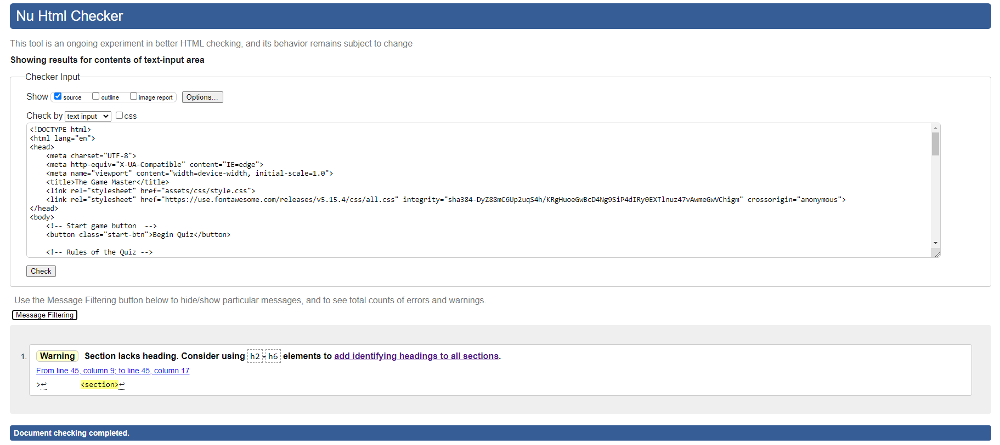
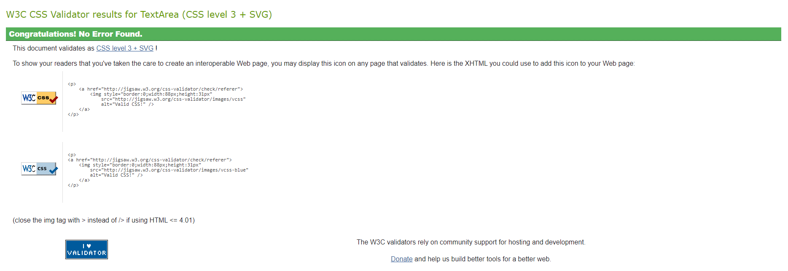
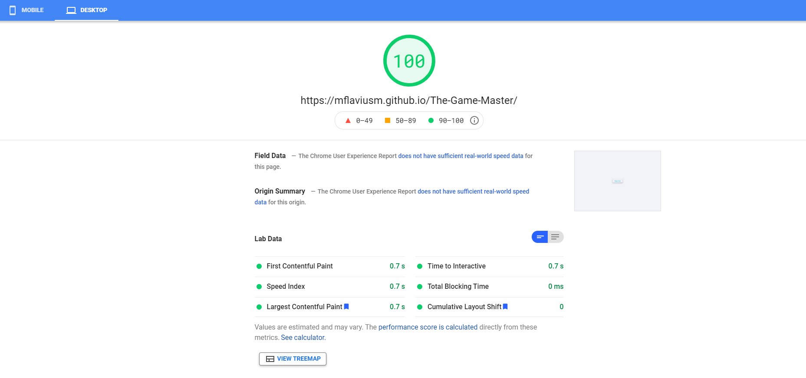
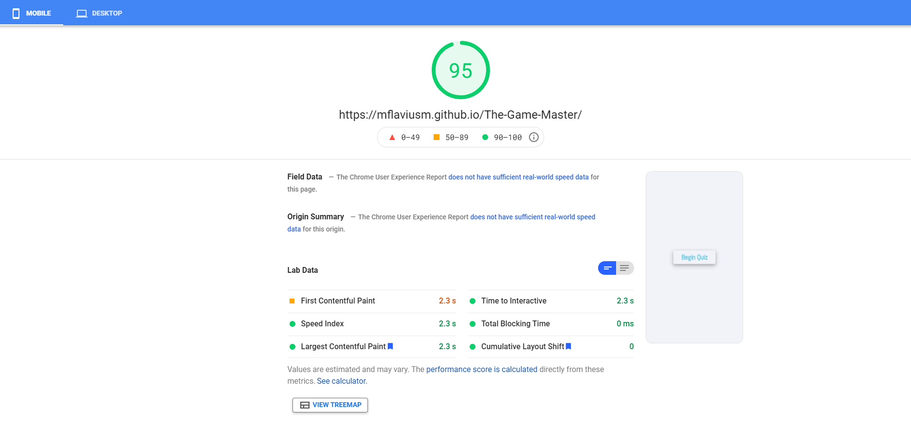
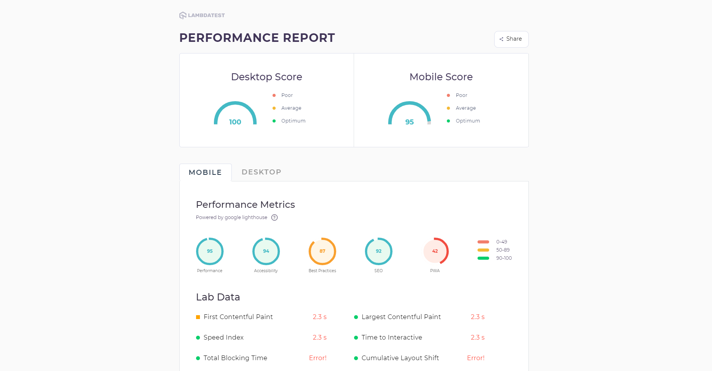

# Testing Page

## Code Validation
  * The W3 Markup Validation Service has been used to check all the HTML files from the project. The only error found was no heading in the section used for the game which was not changed.
  

  * The W3 CSS Validation Service has been used to check all the CSS files from the project. No errors were found.
  

 ## Responsiveness

The responsiveness of the website was tested using PageSpeed Insights and Lambdatest.

[PageSpeed Insights](https://developers.google.com/speed/pagespeed/insights/)

[Lambdatest](https://www.lambdatest.com/lp/cross-browser-testing/)

## Browser Compatibility

The website was developed on Google Chrome 92.0.4515.131.

BrowserStack was used to check browser compatibility.
The website has been checked against various browsers and versions such as:
 - Mozilla Firefox: 89 to 82
 - Google Chrome: 91 to 85
 - Opera: 77 to 72
 - Microsoft Edge: 91 to 89

## Bugs

The following bugs were encountered and fixed during development:

- Real-time score tracker was not resetting after the try again button in the end screen was being pressed.
- After pressing the try again button when answering the first question, the user would be prompted to the end screen again.
